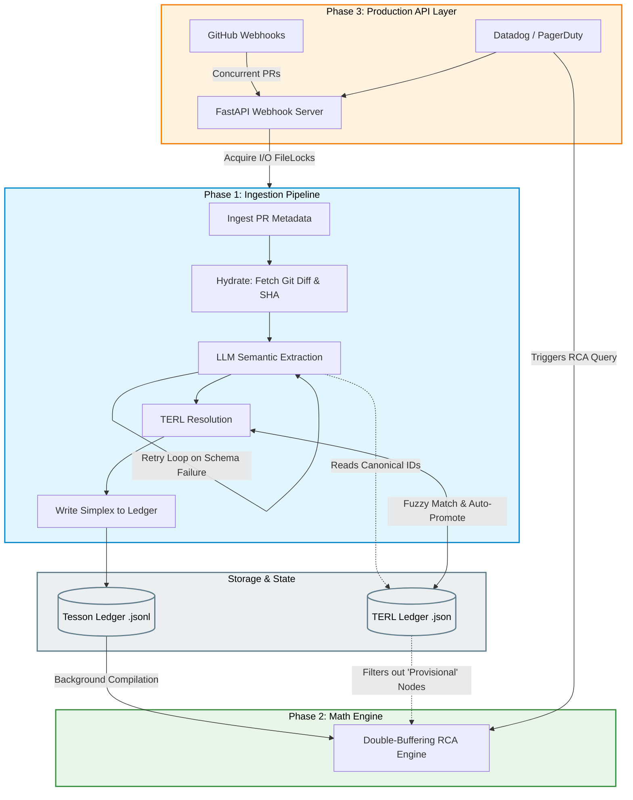
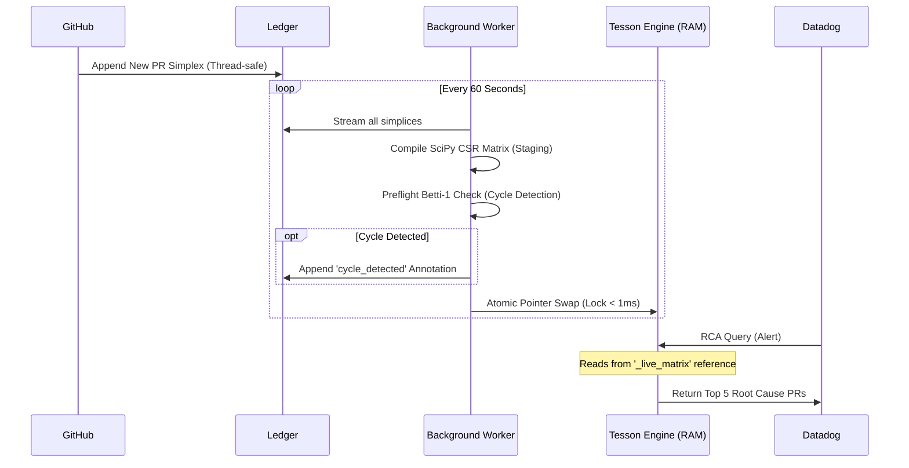

# Tesson (formerly Axiom)

Tesson is an automated ingestion pipeline and sparse matrix modeling engine for enterprise microservice architectures.

It works by listening to GitHub pull requests, semantically parsing the Git diffs using an LLM, and outputting an immutable, mathematically pure ledger of system topologies. This ledger powers an asynchronous Sparse Matrix Engine for mapping system dependencies, detecting architectural cycles, and executing Root Cause Analysis (RCA).

## System Architecture

### 1. High-Level Data Flow

This diagram illustrates how Webhooks flow through the LangGraph ingestion pipeline into the immutable ledger, and how the RCA Engine reads from the compiled math matrix to serve alerts.



### 2. Asynchronous Double-Buffering & Cycle Detection

This diagram explains the internal mechanics of the Phase 2 Math Engine. It demonstrates how incoming Datadog alerts are served instantly with zero blocking, while a background thread compiles the matrix and checks for topological cycles (circular dependencies).



## Core Capabilities

- **100% Automated Ingestion:** No manual data entry required. Tesson parses raw Git Diffs from merged PRs.
- **Deterministic Baseline:** PR metadata (Commit SHA, Merge Timestamps) is deterministically fetched directly from the GitHub API, completely bypassing the LLM to prevent metadata hallucination.
- **Strict Semantic Parsing:** The LLM is forced to output structured JSON (using Pydantic `TessonSimplexExtraction`). If it fails validation, a LangGraph state machine automatically catches the error and feeds it back to the LLM for self-correction.
- **The Hybrid TERL (Tesson Entity Resolution Ledger):** The system's anti-hallucination firewall. It prevents duplicate nodes and handles the fuzzy-matching of microservice aliases.
- **Topological Pre-flight:** As new PRs are ingested, Tesson mathematically calculates the Betti-1 homology ($\beta_1 = E - V + C$) to detect architectural circular dependencies automatically.
- **Provisional Fast-Path (The Trapdoor):** Alerts targeting day-one infrastructure (provisional entities not yet in the math matrix) bypass the matrix entirely and directly scan the ledger, ensuring 100% RCA coverage from the first deployment.

## How The Hybrid TERL Works

To balance high ingestion velocity with mathematical matrix purity, Tesson uses a **"Rule of 3" Auto-Promotion** system:

1. **Provisional Status:** When the LLM extracts a completely novel microservice node, the TERL quarantines it with a `provisional` status.
2. **Sighting Tracking:** The TERL tracks which PRs touch this provisional entity.
3. **Auto-Promotion:** If the exact provisional entity is seen in **3 distinct PRs**, the TERL considers it mathematically verified and automatically promotes it to `canonical`.
4. **Math Engine Filtering:** Downstream mathematical models explicitly filter out any nodes where `status == "provisional"`, ensuring your matrices remain completely clean of LLM hallucinations.

## Getting Started

### Prerequisites
- Python 3.9+
- An API Key for your LLM of choice (Groq, OpenAI, or Gemini)
- GitHub Personal Access Token (for hydrating large Git Diffs)

### Installation
1. Clone the repository and navigate into the `project_tesson` directory.
2. Create and activate a virtual environment:
   ```bash
   python -m venv .venv
   source .venv/bin/activate  # On Windows: .venv\Scripts\activate
   ```
3. Install dependencies:
   ```bash
   pip install -r requirements.txt
   ```

### Configuration
Copy the example environment file and fill in your keys:
```bash
cp .env.example .env
```
Ensure you set your preferred `LLM_PROVIDER` (e.g., `gemini`, `openai`, or `groq`) and the corresponding API key.

### Demonstrations

**1. The Ingestion Pipeline (Phase 1)**
To validate the LangGraph architecture and see the Hybrid TERL in action against 50 real-world pull requests:
```bash
python scripts/run_phase1_proof.py
```

**2. The Math Engine & Diffusion RCA (Phase 2)**
To simulate Datadog alerts and see the sparse matrix rank root causes:
```bash
python demo_rca.py
```

**3. The Double-Buffering Architecture (Phase 2)**
To see how background compilation never blocks live queries and executes instant pointer swaps:
```bash
python demo_double_buffer.py
```

## Project Structure

```text
project_tesson/
├── data/                       # Local storage for ledgers and audit logs
│   ├── audit_logs/             # JSON traces for every PR processed
│   ├── terl_ledger.json        # The stateful Entity Resolution dictionary
│   └── tesson_ledger.jsonl     # The immutable fact table of simplices
├── docs/                       # Project documentation
│   ├── design_document.md      # Detailed architecture and design
│   └── future_scope.md         # Technical debt and future plans
├── scripts/
│   └── run_phase1_proof.py     # Ingestion integration test script
├── demo_rca.py                 # RCA Matrix math demonstration
├── demo_double_buffer.py       # Asynchronous threading demonstration
├── src/
│   ├── api/                    # FastAPI webhooks (Phase 3)
│   ├── engine/                 # Double-buffering, Math, RCA, Pre-flight
│   ├── ingestion/              # The LangGraph pipeline (hydrate, extract, resolve)
│   └── ledger/                 # Ledger IO & Filelocking operations
└── tests/                      # Pytest unit and integration tests
```

## Documentation
For more in-depth architectural details, please see the `docs/` folder:
- [Design Document](docs/design_document.md)
- [Future Scope & Known Issues](docs/future_scope.md)
