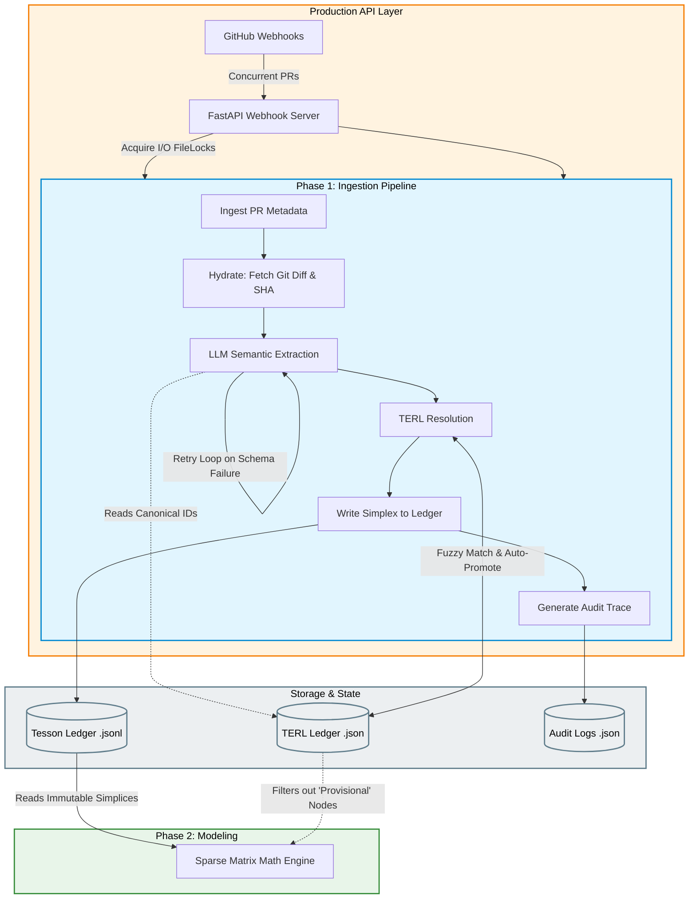

# Tesson (formerly Axiom)

Tesson is an automated ingestion pipeline and sparse matrix modeling engine for enterprise microservice architectures.

It works by listening to GitHub pull requests, semantically parsing the Git diffs using an LLM, and outputting an immutable, mathematically pure ledger of system topologies. This ledger will eventually power a downstream Sparse Matrix Engine for mapping system dependencies.

## System Architecture

GitHub natively renders the flowchart below as an SVG. It illustrates the current MVP implementation (Phase 1) alongside the planned startup production upgrades (Phase 2 and Concurrency API).



## Core Capabilities

- **100% Automated Ingestion:** No manual data entry required. Tesson parses raw Git Diffs from merged PRs.
- **Deterministic Baseline:** PR metadata (Commit SHA, Merge Timestamps) is deterministically fetched directly from the GitHub API, completely bypassing the LLM to prevent metadata hallucination.
- **Strict Semantic Parsing:** The LLM is forced to output structured JSON (using Pydantic `TessonSimplexExtraction`). If it fails validation, a LangGraph state machine automatically catches the error and feeds it back to the LLM for self-correction.
- **The Hybrid TERL (Tesson Entity Resolution Ledger):** The system's anti-hallucination firewall. It prevents duplicate nodes and handles the fuzzy-matching of microservice aliases (e.g., automatically collapsing `redis-cart` and `redis_cache` into a single canonical ID).

## How The Hybrid TERL Works

To balance high ingestion velocity with mathematical matrix purity, Tesson uses a **"Rule of 3" Auto-Promotion** system:

1. **Provisional Status:** When the LLM extracts a completely novel microservice node, the TERL quarantines it with a `provisional` status.
2. **Sighting Tracking:** The TERL tracks which PRs touch this provisional entity.
3. **Auto-Promotion:** If the exact provisional entity is seen in **3 distinct PRs**, the TERL considers it mathematically verified and automatically promotes it to `canonical`.
4. **Math Engine Filtering:** Downstream mathematical models (Phase 2) will explicitly filter out any nodes where `status == "provisional"`, ensuring your matrices remain completely clean of LLM hallucinations.

## Getting Started

### Prerequisites
- Python 3.9+
- An API Key for your LLM of choice (Groq, OpenAI, or Gemini)
- GitHub Personal Access Token (for hydrating large Git Diffs)

### Installation
1. Clone the repository and navigate into the `project_tesson` directory.
2. Create and activate a virtual environment:
   ```bash
   python -m venv .venv
   source .venv/bin/activate  # On Windows: .venv\Scripts\activate
   ```
3. Install dependencies:
   ```bash
   pip install -r requirements.txt
   ```

### Configuration
Copy the example environment file and fill in your keys:
```bash
cp .env.example .env
```
Ensure you set your preferred `LLM_PROVIDER` (e.g., `gemini`, `openai`, or `groq`) and the corresponding API key.

### Running the Phase 1 Proof Script
To validate the architecture and see the Hybrid TERL in action against 50 real-world pull requests:
```bash
python -X utf8 scripts/run_phase1_proof.py
```
This script will:
- Hydrate 50 PRs from the `GoogleCloudPlatform/microservices-demo` repository.
- Run them through the LLM pipeline and the TERL.
- Output JSON audit logs to `data/audit_logs/`.
- Validate that schema integrity and TERL collapse metrics hit 100%.

## Project Structure

```text
project_tesson/
├── data/                       # Local storage for ledgers and audit logs
│   ├── audit_logs/             # JSON traces for every PR processed
│   ├── terl_ledger.json        # The stateful Entity Resolution dictionary
│   └── tesson_ledger.jsonl     # The immutable fact table of simplices
├── docs/                       # Project documentation
│   ├── design_document.md      # Detailed architecture and design
│   └── future_scope.md         # Technical debt and future plans
├── scripts/
│   └── run_phase1_proof.py     # Integration test / proof-of-concept script
├── src/
│   ├── api/                    # FastAPI webhooks (Future)
│   ├── ingestion/              # The LangGraph pipeline (hydrate, extract, resolve)
│   │   ├── audit.py            # Audit logging system
│   │   ├── graph.py            # LangGraph state machine orchestrator
│   │   ├── hydrator.py         # GitHub API deterministic data fetching
│   │   ├── prompt.py           # LLM system prompts
│   │   ├── schemas.py          # Pydantic structured output definitions
│   │   └── terl.py             # The Entity Resolution Ledger
│   └── ledger/                 # Ledger IO operations
└── tests/                      # Pytest unit and integration tests
```

## Documentation
For more in-depth architectural details, please see the `docs/` folder:
- [Design Document](docs/design_document.md)
- [Future Scope & Known Issues](docs/future_scope.md)
