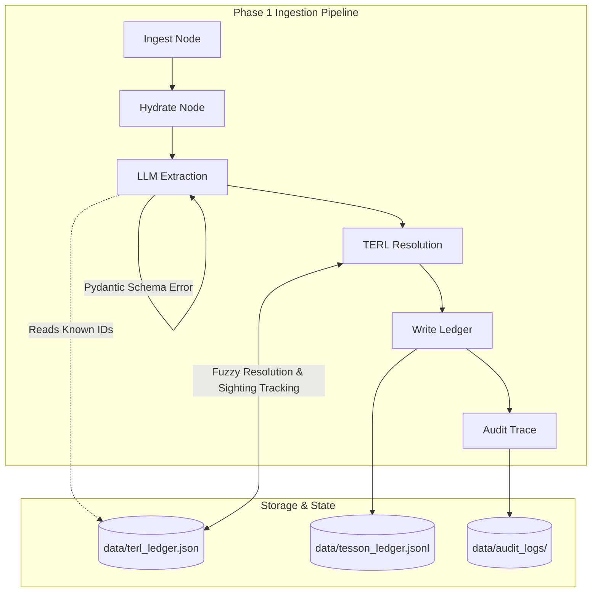
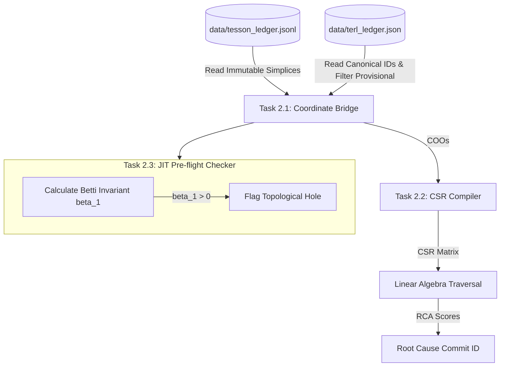

# Tesson: Project Achievements & Technical Roadmap

This document outlines the engineering achievements completed during **Phase 1 (Ingestion & Bedrock)** and details the technical implementation plan for **Phase 2 (The Mathematical Engine & Production Verification)**.

---

## 1. Executive Summary

Tesson is a deterministic, **Zero-Instrumentation Root Cause Analysis (RCA)** engine built for modern enterprise microservice architectures. Traditional Application Performance Monitoring (APM) and AIOps platforms rely on probabilistic models and semantic graph search, which are prone to hallucinations or fail to capture highly concurrent interactions. 

Tesson models enterprise infrastructure as a **Topological Simplicial Complex**. By parsing operational events (GitHub PRs, Jira tickets, alerts) and translating them into strict geometric structures, Tesson compiles coordinate lists into sparse matrices to compute exact structural failures mathematically in sub-millisecond runtimes.

---

## 2. Ingestion & Bedrock Achievements (Phase 1 Completed)

The ingestion pipeline bridges raw human-written code changes and the formal topological schema. All components are implemented in `src/ingestion/` and `src/ledger/`, validated by a suite of unit/integration tests and a 50-PR production proof sweep.



### 2.1 Universal Data Contract (`schemas.py`)
The system's data contracts are defined in [schemas.py](file:///c:/Code_One/ANTIGRAVITY/tesson/project_tesson/src/ingestion/schemas.py) using Pydantic v2:
*   **`TessonNode`**: Represents a topological vertex. The `id` is the Matrix Row ID. The schema strictly enforces a lowercase alphanumeric constraint matching `^[a-z0-9][a-z0-9_\-]{1,127}$` with no spaces or uppercase characters.
*   **`TessonSimplex`**: Represents a geometric connection (edge, triangle, or higher-dimensional simplex) mapping $N \ge 2$ nodes. It enforces:
    *   **Uniqueness**: No duplicate nodes in the same simplex.
    *   **Sorting**: Nodes are sorted lexicographically before validation to ensure a unique canonical simplex representation.
    *   **Flat Metadata**: Evaluates metadata to a flat `dict[str, str]` dictionary, throwing validation errors if nested JSON or non-string values are present.
    *   **Timestamps**: Enforces Unix epoch seconds to bypass timezone issues.

### 2.2 Context Hydration Engine (`hydrator.py`)
To prevent the LLM from hallucinating based on subjective PR descriptions, [hydrator.py](file:///c:/Code_One/ANTIGRAVITY/tesson/project_tesson/src/ingestion/hydrator.py) executes the **Absolute Truth Protocol**:
*   Intercepts Github payloads and uses PyGithub to fetch the raw unified Git diff.
*   Maintains a token budget of `50,000` tokens (~200,000 characters).
*   Implements **file-header-aware truncation**: if a diff exceeds the token budget, it truncates the body but extracts and appends all `diff --git` file headers. This ensures the LLM remains aware of every modified file even under strict budget limits.

### 2.3 Anti-Hallucination Firewall / Hybrid TERL (`terl.py`)
To prevent naming drift (e.g., the LLM producing `redis-cart` in one PR and `redis_cache` in another), [terl.py](file:///c:/Code_One/ANTIGRAVITY/tesson/project_tesson/src/ingestion/terl.py) hosts the **Tesson Entity Resolution Ledger**:
*   **Exact Match Path**: Employs an in-memory hash map (`_alias_map`) for fast $O(1)$ lookups of existing canonical names and registered aliases.
*   **Fuzzy Match Path**: Utilizes RapidFuzz (`fuzz.WRatio`) with a strict `92.0%` similarity threshold to group slightly modified entity names under existing canonical IDs, registering successful matches to speed up future runs.
*   **The "Rule of 3" Auto-Promotion**: Novel entities are quarantined as `provisional` and hidden from the LLM prompt. The TERL tracks which PRs touch them. Upon being sighted in 3 distinct PRs, they are automatically upgraded to `canonical` status.
*   **Memory Optimization**: Once promoted to `canonical`, the entity's `seen_in_prs` sighting tracker array is cleared, preventing unbounded memory growth.

### 2.4 State-Machine Orchestration (`graph.py`)
The pipeline uses LangGraph to coordinate execution in [graph.py](file:///c:/Code_One/ANTIGRAVITY/tesson/project_tesson/src/ingestion/graph.py):
*   Exposes a compiled state graph containing nodes: `ingest` $\rightarrow$ `hydrate` $\rightarrow$ `extract_llm` $\rightarrow$ `resolve_terl` $\rightarrow$ `write_ledger` $\rightarrow$ `audit`.
*   Enforces structured LLM output via `.with_structured_output(TessonSimplexExtraction)`.
*   **Self-Healing Loop**: If the LLM produces a schema violation, LangGraph catches the `ValidationError`, increments a retry counter, and loops back to the LLM node, injecting the specific error message as human correction context. It supports up to 3 self-correction attempts.

### 2.5 Immutable Ledger Store (`store.py`)
The ledger is stored locally in [store.py](file:///c:/Code_One/ANTIGRAVITY/tesson/project_tesson/src/ledger/store.py) in JSON Lines (JSONL) format:
*   **Append-Only & Thread-Safe**: Writes are strictly appends. On POSIX systems, `fcntl.flock(f, fcntl.LOCK_EX)` secures the files from concurrent writes, while Windows uses standard file flushing.
*   **Validation on Read**: Re-validates every line as a `TessonSimplex` on read, skipping corrupt entries without crashing.

### 2.6 Webhook API Receiver (`webhooks.py`)
Exposes FastAPI endpoints in [webhooks.py](file:///c:/Code_One/ANTIGRAVITY/tesson/project_tesson/src/api/webhooks.py):
*   Verifies incoming payloads using GitHub HMAC-SHA256 signature checking.
*   Routes incoming events to an asynchronous background task queue to send them into the LangGraph pipeline, returning an immediate HTTP 202 status.

### 2.7 Pipeline Audit Logging (`audit.py`)
Every pipeline execution writes a file trace to `data/audit_logs/` containing the exact Git diff, the raw LLM output, the validated simplex, and any intermediate errors. This guarantees 100% observability of the ingestion flow.

---

## 3. Phase 1 Verification (The 50-PR Proof Run)

A dedicated integration script, [run_phase1_proof.py](file:///c:/Code_One/ANTIGRAVITY/tesson/project_tesson/scripts/run_phase1_proof.py), validated the pipeline against the last 50 closed/merged PRs of a highly complex microservice repository: `GoogleCloudPlatform/microservices-demo`.

### 3.1 Verification Metrics
1.  **Metric 1 — Schema Integrity**: **100% Pass**. All 50 extracted simplices successfully parsed and validated against the Pydantic `TessonSimplex` schema.
2.  **Metric 2 — TERL Entity Collapse**: **100% Pass**. Verified that messy aliases (`redis-cart`, `RedisCartCache`, `redis_cart`, and `redis`) collapsed deterministically into a single row ID (`redis_cache`).
3.  **Metric 3 — Metadata & Linkage**: **100% Pass**. Checked that all merge commit SHAs matched the git history and all UUIDs were unique.

---

## 4. Phase 2 Technical Roadmap (What's Next)

Phase 2 will implement the mathematical sparse matrix operations to calculate root causes, introduce FastAPI webhook concurrency locking, and add retroactive graph healing.



### Task 2.1 — The Coordinate Bridge
Build the compiler adapter class `CoordinateBridge` inside `src/engine/`:
*   **Ingestion**: Read `tesson_ledger.jsonl` sequentially and parse into Coordinate Lists (COO) representing the node-to-simplex mapping matrix $B$.
*   **Provisional Quarantine**: Query `terl_ledger.json` and filter out any nodes marked `status: "provisional"`. Simplices containing these nodes will be projected onto the canonical subspace by temporarily excluding the provisional vertices.
*   **Mapping**: Map canonical entity IDs to integer row offsets (from `0` to $V-1$) and simplices to column offsets (from `0` to $S-1$).

### Task 2.2 — CSR Compiler & Traversal Engine
Implement the core mathematical matrix solver:
1.  **CSR Compilation**: Translate the COO list into `scipy.sparse.csr_matrix` format for both the boundary matrix $B$ and the entity adjacency matrix $A = B \cdot B^T$.
2.  **Hodge Laplacian & Edge Traversal**:
    *   Implement an execution path that takes an anomaly indicator vector $y$ (e.g., alert on service $X$ and DB $Y$) and calculates diffusion across the topology:
        $$v_{diffuse} = A^k \cdot y$$
    *   Trace the diffusion score back to the corresponding columns in $B$ (representing the simplices, i.e., the commits).
    *   Rank the commits by mathematical influence score to output the exact broken commit ID.

### Task 2.3 — JIT Pre-flight Invariant Checker
Construct the topological inspector to run alongside ingestion:
*   As a new simplex $s_{new}$ is proposed, compute its boundaries relative to the existing graph.
*   Compute the first Betti number $\beta_1 = E - V + C$ (where $E$ is edges, $V$ is vertices, and $C$ is connected components) to detect topological holes (cycles).
*   If a loop is formed (indicating a circular microservice dependency path, e.g., $A \rightarrow B \rightarrow C \rightarrow A$), flag it in the ledger and raise a pre-outage warning.

### Task 2.4 — FastAPI Concurrency File Locking
Address the known race condition described in [future_scope.md](file:///c:/Code_One/ANTIGRAVITY/tesson/project_tesson/docs/future_scope.md):
*   **The Issue**: If multiple webhooks execute the pipeline concurrently, they will read and write to `terl_ledger.json` and `tesson_ledger.jsonl` simultaneously, leading to file corruption.
*   **The Solution**: Integrate the `filelock` library. Every node execution that writes to the TERL or ledger must acquire an exclusive file lock:
    ```python
    from filelock import FileLock
    
    lock = FileLock("data/terl_ledger.json.lock")
    with lock:
        # Load, modify, and write terl_ledger.json
    ```
*   Implement non-blocking lock acquisitions with timeouts to return a clean HTTP 409 or retry internally when the lock is busy.

### Task 2.5 — Entity Classification Heuristics
Extend the LLM semantic parser and write a post-processing module inside `src/engine/`:
*   Use graph connectivity and edge directionality in the adjacency matrix to classify newly created provisional entities.
*   For instance, a node with high incoming edge density and zero outgoing edges is automatically classified as `EntityType.DB` or `EntityType.CACHE` instead of defaulting to `EntityType.SERVICE`.

### Task 2.6 — Retroactive Graph Healing
Ensure the Math Engine resolves historical states dynamically:
*   The raw simplices stored in `tesson_ledger.jsonl` are immutable and contain provisional node IDs.
*   When compiling the matrix, the Math Engine queries the *current* state of the TERL. 
*   If a node was provisional when a simplex was written 20 days ago, but has since been promoted to canonical, the Math Engine will now include it in the active matrix. This automatically heals the historical dependency graph without modifying the append-only ledger files.

---

## 5. Phase 2 Verification Plan

Verification of Phase 2 will involve both mathematical benchmarks and integration tests:

### 5.1 Automated Mathematical Verification
*   **Matrix Traversal Test**: Create a mock coordinate matrix representing a simple path $A \rightarrow B \rightarrow C$, trigger an alert on $C$, and verify that the Hodge Laplacian traversal points to the commit that introduced $B \rightarrow C$ as the root cause.
*   **Pre-flight Cycle Test**: Write a unit test that feeds the pipeline a simplex completing a circular dependency loop and verify that $\beta_1$ increases, triggering the topological cycle alarm.
*   **Concurrency Load Test**: Run a local load test script (using Locust or concurrent `asyncio` tasks) that pushes 20 simultaneous webhooks into the FastAPI webhook server. Validate that:
    *   No file corruption occurs in the JSON/JSONL ledgers.
    *   No entries are lost.
    *   File locking gracefully handles contention.

### 5.2 Manual & Simulation Benchmarks
*   Deploy a test runner that compares the CPU and memory consumption of compiling matrices at scale ($10,000+$ elements). Ensure execution completes in under **100 milliseconds**.
