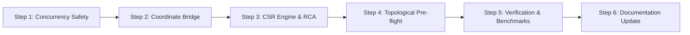
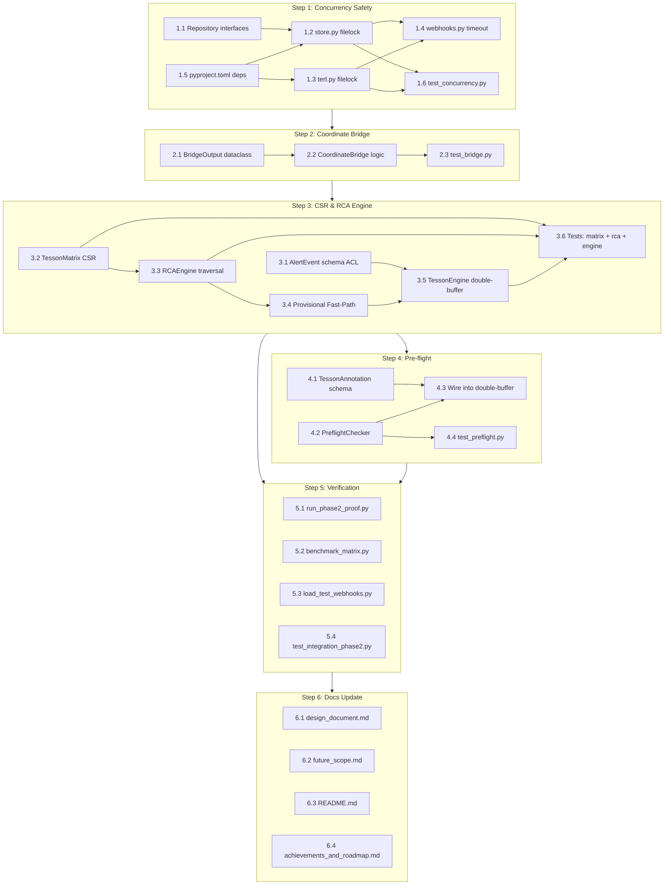

# Phase 2: The Math Engine & Production Verification (v2)

> [!NOTE]
> **Revision v2** — Incorporates all architectural decisions from the review session. Key changes from v1: Subspace Projection replaces full-simplex dropping, Asynchronous Double-Buffering replaces query-time recompilation, Anti-Corruption Layer for alert schemas, Provisional Fast-Path for RCA on new infrastructure, Repository Pattern for storage abstraction, Async post-ingestion cycle detection via Annotation Events, Entity Classification deferred to Phase 3, mmap documented as future scope.

---

## Background & Scope

Phase 1 is complete and validated: 50 real PRs, 100% schema integrity, 100% TERL entity collapse, 100% deterministic metadata. Phase 2 transforms the flat JSONL ledger into a live sparse matrix RCA engine.

### Current Data Snapshot

| Metric | Value |
|---|---|
| Total simplices in `proof_ledger.jsonl` | 50 |
| Unique canonical node IDs in the ledger | 16 |
| TERL entities (total) | 21 (20 canonical + 1 provisional) |
| Provisional entities | 1 (`commit`, seen in 2 PRs) |

### Architectural Decisions (Locked In)

| Decision | Choice | Rationale |
|---|---|---|
| Provisional node handling | **Subspace Projection + Dimensionality Gating** | Never drop valid canonical connections; only discard simplices that collapse below 2 nodes after filtering |
| Matrix recompilation | **Asynchronous Double-Buffering** | Never block RCA queries; background worker compiles, atomic pointer swap to live |
| Alert input | **Anti-Corruption Layer** — Pydantic `AlertEvent` at API edge, raw `list[int]` inside math engine | Firewall at the boundary, pure math inside |
| Provisional entity alerts | **Provisional Fast-Path (Trapdoor)** — bypass matrix, O(1) ledger lookup | 100% RCA coverage even for Day-1 infrastructure |
| Storage abstraction | **Repository Pattern** | File-based now, Postgres later, zero code changes in engine |
| Pre-flight cycle detection | **Async Post-Ingestion** — piggybacks on Double-Buffer worker, uses Annotation Events | Never block webhook ingestion |
| Entity classification | **Deferred to Phase 3** | Not on critical path for RCA |

---

## Proposed Changes

6 sequential steps, 28 sub-tasks. Each step produces a **testable milestone** before the next begins.



---

## Step 1: Concurrency & Ledger Safety

**Goal:** Protect all IO from race conditions. Introduce the Repository Pattern abstraction.

**New dependency:** `filelock>=3.15`

---

### Sub-task 1.1 — Repository Pattern Interface

#### [NEW] [repository.py](file:///c:/Code_One/ANTIGRAVITY/tesson/project_tesson/src/ledger/repository.py)

Define an abstract `LedgerRepository` contract that all storage backends implement. This is the foundation for the Postgres migration path without touching the engine or API code.

```python
from abc import ABC, abstractmethod

class LedgerRepository(ABC):
    """Abstract contract for ledger persistence backends."""

    @abstractmethod
    def append_simplex(self, simplex: TessonSimplex) -> None: ...

    @abstractmethod
    def stream_simplices(self) -> Generator[TessonSimplex, None, None]: ...

    @abstractmethod
    def read_all_simplices(self) -> list[TessonSimplex]: ...

    @abstractmethod
    def count_simplices(self) -> int: ...


class TERLRepository(ABC):
    """Abstract contract for TERL persistence backends."""

    @abstractmethod
    def load(self) -> dict[str, dict]: ...

    @abstractmethod
    def save(self, store: dict[str, dict]) -> None: ...
```

**Acceptance:** Interfaces defined. No implementation changes yet.

---

### Sub-task 1.2 — File-Based Repository Implementation with `filelock`

#### [MODIFY] [store.py](file:///c:/Code_One/ANTIGRAVITY/tesson/project_tesson/src/ledger/store.py)

- Make `store.py` implement `LedgerRepository`
- Remove the platform-branching (`_append_posix` / `_append_windows`)
- Replace with a single `_append_locked()` using `FileLock(str(path) + ".lock")`
- Lock timeout: 30 seconds → raises `filelock.Timeout`
- `stream()` and `read_all()` do NOT need locking (append-only JSONL is safe to read concurrently)

**Acceptance:** `append()` acquires an exclusive file lock. Two concurrent calls never interleave data. Lock timeout raises a clean exception.

---

### Sub-task 1.3 — TERL File Locking

#### [MODIFY] [terl.py](file:///c:/Code_One/ANTIGRAVITY/tesson/project_tesson/src/ingestion/terl.py)

- Add `FileLock(str(self.ledger_path) + ".lock")` to `_persist()` (exclusive)
- Add the same lock to `_load_from_disk()` (exclusive — we want consistent reads)
- Timeout: 30 seconds

**Acceptance:** TERL state file is never corrupted under concurrent pipeline execution.

---

### Sub-task 1.4 — Webhook Timeout Handling

#### [MODIFY] [webhooks.py](file:///c:/Code_One/ANTIGRAVITY/tesson/project_tesson/src/api/webhooks.py)

- Wrap `run_pipeline()` in `_process_github_event()` with `try/except` for `filelock.Timeout`
- On timeout: log a warning with PR context. GitHub auto-retries webhook delivery.

**Acceptance:** Lock timeout does not crash FastAPI. Error is logged with PR number.

---

### Sub-task 1.5 — Dependency Update

#### [MODIFY] [pyproject.toml](file:///c:/Code_One/ANTIGRAVITY/tesson/project_tesson/pyproject.toml)

Add to `dependencies`:
- `"filelock>=3.15"`
- `"scipy>=1.13"`
- `"numpy>=1.26"`

**Acceptance:** `pip install -e .` succeeds.

---

### Sub-task 1.6 — Concurrency Tests

#### [NEW] [test_concurrency.py](file:///c:/Code_One/ANTIGRAVITY/tesson/project_tesson/tests/test_ingestion/test_concurrency.py)

3 tests:
1. **`test_concurrent_ledger_appends`**: 10 threads, each appending a simplex. Verify all 10 present, no interleaving.
2. **`test_concurrent_terl_persist`**: 2 threads both `resolve_entity()` with novel entities. Both persisted in valid JSON.
3. **`test_lock_timeout_raises`**: Hold a lock manually, attempt write with 1s timeout, verify `filelock.Timeout` raised.

---

**Step 1 Milestone:** All existing tests pass. 3 new concurrency tests pass. Repository interfaces exist.

---

## Step 2: The Coordinate Bridge & Retroactive Healing

**Goal:** Translate the string-based JSONL ledger into raw numeric COO arrays. Implement Subspace Projection with Dimensionality Gating so no valid canonical connections are ever lost.

---

### Sub-task 2.1 — `BridgeOutput` Dataclass

#### [NEW] [bridge.py](file:///c:/Code_One/ANTIGRAVITY/tesson/project_tesson/src/engine/bridge.py)

Define the output contract first:

```python
@dataclass
class BridgeOutput:
    """The output of a CoordinateBridge compilation."""
    # COO arrays for the boundary matrix B
    row_indices: np.ndarray       # (nnz,) — entity integer indices
    col_indices: np.ndarray       # (nnz,) — simplex integer indices
    data: np.ndarray              # (nnz,) — all 1s (incidence)

    # Bidirectional mappings
    entity_to_index: dict[str, int]
    index_to_entity: dict[int, str]
    simplex_to_index: dict[str, int]
    index_to_simplex: dict[int, str]

    # Stats
    num_entities: int             # V (rows in B)
    num_simplices: int            # S (columns in B)
    num_nonzero: int
    skipped_simplices: int        # Dropped because < 2 canonical nodes after projection
    projected_simplices: int      # Kept but with provisional nodes removed

    # Traceability maps (for RCA output)
    simplex_pr_map: dict[str, int | None]
    simplex_sha_map: dict[str, str | None]
```

---

### Sub-task 2.2 — `CoordinateBridge` Core Logic

Still in [bridge.py](file:///c:/Code_One/ANTIGRAVITY/tesson/project_tesson/src/engine/bridge.py):

```python
class CoordinateBridge:
    """Translates the JSONL string ledger → numeric COO arrays.

    Implements Subspace Projection with Dimensionality Gating:
      1. Read each simplex from the ledger
      2. For each node, check TERL status
      3. Drop provisional nodes from the node array (in RAM only)
      4. If len(remaining_nodes) >= 2: keep the simplex (projected)
      5. If len(remaining_nodes) < 2: discard the simplex
      6. Never modify the source JSONL file
    """

    def __init__(
        self,
        ledger_path: Path | None = None,
        terl_path: Path | None = None,
    ) -> None: ...

    def compile(self) -> BridgeOutput: ...
```

**Critical algorithm — Subspace Projection:**
```
for each simplex in ledger:
    canonical_nodes = [n for n in simplex.nodes if terl.get_status(n) == "canonical"]
    if len(canonical_nodes) >= 2:
        # Keep this simplex — assign integer indices to canonical_nodes
        # Record as "projected" if len(canonical_nodes) < len(simplex.nodes)
    else:
        # Skip — a lone node forms no edge
        skipped_count += 1
```

**Retroactive Healing is automatic:** The bridge reads the *current* TERL state on every `compile()`. If entity `commit` was provisional yesterday but was promoted today, the simplices containing it will naturally be included in the next compilation.

**Acceptance:**
- Using proof data: `compile()` returns indices for the 16 canonical entities
- Simplices containing `commit` (provisional) are projected: `commit` is removed but remaining canonical nodes are kept if ≥ 2
- `entity_to_index[index_to_entity[i]] == i` for all `i`
- The source JSONL file is never modified

---

### Sub-task 2.3 — Bridge Unit Tests

#### [NEW] [tests/test_engine/__init__.py](file:///c:/Code_One/ANTIGRAVITY/tesson/project_tesson/tests/test_engine/__init__.py)
#### [NEW] [tests/test_engine/test_bridge.py](file:///c:/Code_One/ANTIGRAVITY/tesson/project_tesson/tests/test_engine/test_bridge.py)

6 tests:
1. **`test_simple_two_simplex_bridge`**: 2 simplices, 3 canonical entities → correct COO shapes
2. **`test_subspace_projection`**: Simplex `[A, B, provisional_X]` → projected to `[A, B]` (kept, 2 nodes)
3. **`test_dimensionality_gate_drops_singleton`**: Simplex `[canonical_A, provisional_B]` → after removing `provisional_B`, only 1 node → discarded
4. **`test_retroactive_healing`**: Write simplex with provisional node → compile (skipped/projected) → promote node → recompile → node now included
5. **`test_empty_ledger`**: Empty file → empty arrays, no crash
6. **`test_index_consistency`**: Verify bidirectional mappings are exact inverses

---

**Step 2 Milestone:** `BridgeOutput` populates correctly from real proof data. Subspace Projection demonstrably preserves valid connections. Retroactive healing test passes.

---

## Step 3: CSR Compilation, Double-Buffer Engine & RCA

**Goal:** Build the core mathematical engine. Implement the Asynchronous Double-Buffering pattern so RCA queries are never blocked. Implement the Provisional Fast-Path (Trapdoor) for 100% RCA coverage.

---

### Sub-task 3.1 — Alert Schema (Anti-Corruption Layer)

#### [NEW] [src/api/alert_schemas.py](file:///c:/Code_One/ANTIGRAVITY/tesson/project_tesson/src/api/alert_schemas.py)

Formal Pydantic schema at the API edge. The math engine never imports this.

```python
class AlertEvent(BaseModel):
    """Incoming alert from Datadog/PagerDuty/etc."""
    alert_entities: list[str] = Field(
        ..., min_length=1,
        description="Canonical entity IDs that are failing."
    )
    severity: str = Field(
        default="critical",
        description="Alert severity level."
    )
    source: str = Field(
        default="manual",
        description="Alert source system (e.g., 'datadog', 'pagerduty')."
    )
    timestamp: int | None = Field(
        default=None,
        description="Unix epoch timestamp of the alert."
    )

class RCAResponse(BaseModel):
    """Structured RCA output returned to the API caller."""
    results: list[RCAResultItem]
    path_used: str  # "matrix" or "provisional_fast_path"
    matrix_stats: dict

class RCAResultItem(BaseModel):
    commit_sha: str | None
    pr_number: int | None
    simplex_id: str
    score: float
    involved_entities: list[str]
```

**Acceptance:** Pydantic validates incoming alerts. Malformed payloads are rejected at the API boundary.

---

### Sub-task 3.2 — `TessonMatrix` (CSR Compilation)

#### [NEW] [src/engine/matrix.py](file:///c:/Code_One/ANTIGRAVITY/tesson/project_tesson/src/engine/matrix.py)

```python
class TessonMatrix:
    """Compiles B (boundary) and A (adjacency) from COO data."""

    def __init__(self, bridge_output: BridgeOutput) -> None:
        # Build B as coo_matrix → .tocsr()
        # Compute A = B @ B.T
        ...

    @property
    def boundary(self) -> csr_matrix: ...       # shape: (V, S)

    @property
    def adjacency(self) -> csr_matrix: ...      # shape: (V, V), symmetric

    def entity_degree(self, entity_id: str) -> int: ...

    def stats(self) -> dict: ...
```

**Acceptance:**
- `B.shape == (V, S)`
- `A.shape == (V, V)`, symmetric (`A == A.T`)
- `A[i, j] > 0` iff entities `i` and `j` co-appear in ≥ 1 simplex
- Diagonal `A[i, i]` = number of simplices entity `i` participates in

---

### Sub-task 3.3 — `RCAEngine` (Traversal & Root Cause Ranking)

#### [NEW] [src/engine/rca.py](file:///c:/Code_One/ANTIGRAVITY/tesson/project_tesson/src/engine/rca.py)

The math engine is **Pydantic-free**. It takes raw integer indices and numpy arrays.

```python
@dataclass
class RCAResult:
    commit_sha: str | None
    pr_number: int | None
    simplex_id: str
    score: float
    involved_entities: list[str]

class RCAEngine:
    """Root Cause Analysis via adjacency diffusion."""

    def __init__(self, matrix: TessonMatrix) -> None: ...

    def trace(
        self,
        alert_entity_indices: list[int],
        hops: int = 3,
        top_k: int = 5,
    ) -> list[RCAResult]:
        """
        Algorithm:
          1. Build One-Hot vector y from alert_entity_indices
          2. Compute v_diffuse = A^k · y
          3. Map scores back to simplices via B^T
          4. Rank simplices by diffusion weight
          5. Return top_k with commit SHA + PR number
        """
        ...
```

**Acceptance:**
- Mock `A → B → C`: alerting on `C` traces to the `A-B` simplex
- Results sorted by descending score
- Each result includes commit SHA and PR number

---

### Sub-task 3.4 — Provisional Fast-Path (The Trapdoor)

Still in [rca.py](file:///c:/Code_One/ANTIGRAVITY/tesson/project_tesson/src/engine/rca.py) or a dedicated helper:

```python
def provisional_fast_path(
    alert_entity: str,
    ledger_path: Path,
) -> list[RCAResult]:
    """O(n) scan of the ledger for simplices containing a provisional entity.

    Because a provisional entity has been seen in at most 2 PRs,
    the blast radius is tiny. We don't need matrix diffusion —
    we just return the PRs that introduced it.
    """
    ...
```

**The Routing Fork (inside the API layer, not the engine):**
1. Alert arrives with entity IDs
2. For each entity, check TERL status
3. **Canonical entities** → build One-Hot vector → matrix diffusion ($A^k \cdot y$)
4. **Provisional entities** → bypass matrix → direct ledger scan → return the 1-2 PRs

**Acceptance:**
- A provisional entity alert returns the exact PRs from the ledger
- A canonical entity alert uses matrix diffusion
- Mixed alerts correctly fork into both paths and merge results

---

### Sub-task 3.5 — Asynchronous Double-Buffering Engine

#### [NEW] [src/engine/engine.py](file:///c:/Code_One/ANTIGRAVITY/tesson/project_tesson/src/engine/engine.py)

This is the runtime orchestrator that keeps a hot matrix in RAM.

```python
class TessonEngine:
    """Asynchronous Double-Buffering matrix engine.

    Architecture:
      - _live_matrix: The currently active TessonMatrix in RAM, serving queries.
      - Background worker: Periodically reads the ledger, compiles a new
        "staging" matrix, then atomically swaps it into _live_matrix.
      - RCA queries always hit _live_matrix — never block on compilation.
    """

    def __init__(
        self,
        ledger_path: Path | None = None,
        terl_path: Path | None = None,
        recompile_interval_seconds: float = 60.0,
    ) -> None:
        self._live_matrix: TessonMatrix | None = None
        self._live_rca: RCAEngine | None = None
        self._lock = threading.Lock()  # protects the pointer swap
        ...

    def start_background_worker(self) -> None:
        """Start the background thread that periodically recompiles."""
        ...

    def stop_background_worker(self) -> None: ...

    def _recompile(self) -> None:
        """Build a new staging matrix, then atomic-swap to live."""
        bridge = CoordinateBridge(self._ledger_path, self._terl_path)
        output = bridge.compile()
        staging_matrix = TessonMatrix(output)
        staging_rca = RCAEngine(staging_matrix)

        with self._lock:
            self._live_matrix = staging_matrix
            self._live_rca = staging_rca
        # Old matrix is now unreferenced → garbage collected

    def query_rca(
        self,
        alert_entities: list[str],
        hops: int = 3,
        top_k: int = 5,
    ) -> list[RCAResult]:
        """Route the alert through canonical (matrix) or provisional (fast-path)."""
        ...

    def force_recompile(self) -> None:
        """Manually trigger a recompilation (for tests / admin)."""
        ...
```

**Acceptance:**
- `query_rca()` returns instantly from the live matrix (no recompilation)
- Background worker atomically swaps the matrix pointer
- `force_recompile()` works for synchronous testing
- Thread-safe: concurrent `query_rca()` and `_recompile()` do not crash

---

### Sub-task 3.6 — Matrix & RCA Unit Tests

#### [NEW] [tests/test_engine/test_matrix.py](file:///c:/Code_One/ANTIGRAVITY/tesson/project_tesson/tests/test_engine/test_matrix.py)

5 tests:
1. **`test_boundary_matrix_shape`**: 3 entities, 2 simplices → `B.shape == (3, 2)`
2. **`test_adjacency_symmetry`**: `A == A.T`
3. **`test_adjacency_diagonal`**: Diagonal = participation counts
4. **`test_disconnected_components`**: 2 isolated pairs → A has 2 separate blocks
5. **`test_from_proof_data`**: Real proof data → shapes match expected counts

#### [NEW] [tests/test_engine/test_rca.py](file:///c:/Code_One/ANTIGRAVITY/tesson/project_tesson/tests/test_engine/test_rca.py)

5 tests:
1. **`test_linear_chain_rca`**: `A-B`, `B-C` topology. Alert on `C` → root cause points to `A-B` simplex
2. **`test_triangle_rca`**: `A-B-C` triangle. Alert on `A` → all 3 simplices in results
3. **`test_isolated_node_no_rca`**: Alert on disconnected node → empty results
4. **`test_top_k_ranking`**: Results sorted by score, limited to `top_k`
5. **`test_provisional_fast_path`**: Provisional entity alert → direct ledger scan returns exact PRs

#### [NEW] [tests/test_engine/test_engine.py](file:///c:/Code_One/ANTIGRAVITY/tesson/project_tesson/tests/test_engine/test_engine.py)

3 tests:
1. **`test_double_buffer_swap`**: Force recompile → verify live matrix updates
2. **`test_query_before_compile`**: `query_rca()` before any compile → returns empty, no crash
3. **`test_mixed_alert_routing`**: Alert with 1 canonical + 1 provisional entity → both paths return results

---

**Step 3 Milestone:** Full `alert → routing fork → matrix diffusion OR ledger scan → ranked commit list` pipeline works end-to-end. Double-buffer swap is thread-safe. The RCA engine + Provisional Fast-Path together provide 100% RCA coverage.

---

## Step 4: Topological Pre-flight & Cycle Detection (Async)

**Goal:** Detect when a newly ingested simplex creates a circular dependency. Runs as an async post-ingestion task piggybacking on the Double-Buffer background worker. Uses append-only Annotation Events to flag cycles without modifying historical ledger entries.

---

### Sub-task 4.1 — Annotation Event Schema

#### [MODIFY] [schemas.py](file:///c:/Code_One/ANTIGRAVITY/tesson/project_tesson/src/ingestion/schemas.py)

Add a new `TessonAnnotation` model:

```python
class TessonAnnotation(BaseModel):
    """An append-only annotation event for the ledger.

    Used to flag structural anomalies (e.g., cycles) without
    modifying historical simplex entries.
    """
    annotation_id: str = Field(default_factory=lambda: str(uuid.uuid4()))
    annotation_type: str  # e.g., "cycle_detected"
    target_simplex_id: str  # The simplex that triggered the annotation
    timestamp: int = Field(default_factory=lambda: int(time.time()))
    details: dict[str, str] = Field(default_factory=dict)
```

**Acceptance:** The annotation model validates correctly. It is append-only compatible with the JSONL ledger format.

---

### Sub-task 4.2 — `PreflightChecker` Class

#### [NEW] [src/engine/preflight.py](file:///c:/Code_One/ANTIGRAVITY/tesson/project_tesson/src/engine/preflight.py)

```python
@dataclass
class PreflightResult:
    has_cycle: bool
    betti_1: int
    cycle_entities: list[str]
    message: str

class PreflightChecker:
    """Detects topological cycles when new simplices are added."""

    def __init__(self, matrix: TessonMatrix) -> None: ...

    def check(self, new_simplex_nodes: list[str]) -> PreflightResult:
        """
        1. Temporarily augment the boundary matrix with the new simplex
        2. Compute adjacency of augmented graph
        3. Calculate β₁ = E - V + C
        4. If β₁ > 0: cycle detected
        Does NOT mutate the live matrix.
        """
        ...
```

---

### Sub-task 4.3 — Wire Pre-flight into Double-Buffer Worker

#### [MODIFY] [engine.py](file:///c:/Code_One/ANTIGRAVITY/tesson/project_tesson/src/engine/engine.py)

Extend the `_recompile()` method:
- After building the staging matrix, run the `PreflightChecker` against any simplices that are new since the last compilation
- If a cycle is detected, append a `TessonAnnotation` to the ledger (using the locked `store.append()`)
- Log a high-priority warning

**Acceptance:** The annotation is written to the ledger. The pre-flight check does not block ingestion. The live matrix is not mutated during the check.

---

### Sub-task 4.4 — Pre-flight Tests

#### [NEW] [tests/test_engine/test_preflight.py](file:///c:/Code_One/ANTIGRAVITY/tesson/project_tesson/tests/test_engine/test_preflight.py)

4 tests:
1. **`test_no_cycle_linear_chain`**: `A-B`, `B-C` → `betti_1 == 0`
2. **`test_cycle_detected`**: `A-B`, `B-C`, add `C-A` → `betti_1 == 1`, cycle entities include `A, B, C`
3. **`test_multiple_cycles`**: 2 independent loops → `betti_1 == 2`
4. **`test_check_does_not_mutate_matrix`**: Live matrix unchanged after check

---

**Step 4 Milestone:** Cycle detection works on synthetic topologies. Pre-flight annotations are appended to the ledger asynchronously. No impact on ingestion latency.

---

## Step 5: Integration Verification & Benchmarking

**Goal:** Prove the complete Phase 2 system end-to-end and hit the performance targets from the Master Engineering Spec.

---

### Sub-task 5.1 — Phase 2 Proof Script

#### [NEW] [scripts/run_phase2_proof.py](file:///c:/Code_One/ANTIGRAVITY/tesson/project_tesson/scripts/run_phase2_proof.py)

End-to-end integration script:
1. Load the 50-simplex proof ledger from Phase 1
2. Compile the Coordinate Bridge (verify subspace projection stats)
3. Build the CSR matrices (print B and A shapes, density, nnz)
4. Run an RCA query on canonical entities (e.g., alert on `cart_service` + `redis_cache`)
5. Run an RCA query on the provisional entity (`commit`) — verify Trapdoor fast-path activates
6. Run the pre-flight checker on each simplex sequentially
7. Print a full report

---

### Sub-task 5.2 — Performance Benchmark Script

#### [NEW] [scripts/benchmark_matrix.py](file:///c:/Code_One/ANTIGRAVITY/tesson/project_tesson/scripts/benchmark_matrix.py)

Generate synthetic data:
- 10,000 entities, 50,000 simplices
- Compile boundary + adjacency matrices
- Run `A^k · y` traversal (3 hops)
- **Target: < 100ms** (Milestone 2 from Master Spec)
- Measure and report: compilation time, traversal time, memory footprint

---

### Sub-task 5.3 — Concurrency Load Test

#### [NEW] [scripts/load_test_webhooks.py](file:///c:/Code_One/ANTIGRAVITY/tesson/project_tesson/scripts/load_test_webhooks.py)

- Use `concurrent.futures.ThreadPoolExecutor` or `asyncio` with 20 simultaneous simulated webhook payloads
- Verify: no file corruption, no lost entries, file locking gracefully handles contention
- Report: success rate, lock contention time, total entries written

---

### Sub-task 5.4 — Full Integration Tests

#### [NEW] [tests/test_engine/test_integration_phase2.py](file:///c:/Code_One/ANTIGRAVITY/tesson/project_tesson/tests/test_engine/test_integration_phase2.py)

3 tests:
1. **`test_ledger_to_rca_e2e`**: Write 5 simplices → compile → build matrix → RCA → non-empty results with valid commit SHAs
2. **`test_concurrent_ingest_then_compile`**: 5 threads write simplices (with filelock) → compile bridge → all 5 present
3. **`test_retroactive_healing_e2e`**: Write simplex with provisional node → compile (projected/skipped) → promote node → recompile → RCA now includes previously-skipped simplex

---

**Step 5 Milestone:** Phase 2 proof script runs successfully. Benchmark meets < 100ms target. All integration tests pass.

---

## Step 6: Documentation Update

**Goal:** Update all project documentation to reflect the Phase 2 architectural decisions, new components, and future scope including mmap.

---

### Sub-task 6.1 — Update Design Document

#### [MODIFY] [docs/design_document.md](file:///c:/Code_One/ANTIGRAVITY/tesson/project_tesson/docs/design_document.md)

Add the following sections:

1. **Phase 2 Architecture** — The Dual-Layer system (Active-RAM Matrix + Immutable Ledger)
2. **Subspace Projection with Dimensionality Gating** — How provisional nodes are handled without data loss
3. **Asynchronous Double-Buffering** — The Live Matrix / Staging Matrix / Atomic Swap pattern
4. **The Provisional Fast-Path (Trapdoor)** — Dual-path RCA routing for canonical vs. provisional entities
5. **Anti-Corruption Layer** — Pydantic at the API edge, pure math inside the engine
6. **Repository Pattern** — Storage abstraction for file-based → Postgres migration
7. **Async Cycle Detection** — Betti number computation via Annotation Events

---

### Sub-task 6.2 — Update Future Scope

#### [MODIFY] [docs/future_scope.md](file:///c:/Code_One/ANTIGRAVITY/tesson/project_tesson/docs/future_scope.md)

Add the following items:

1. **Memory-Mapped Files (mmap) & Custom Binary Format** — The end-state persistence approach:
   - Compile the matrix into an optimized raw binary file (e.g., `tesson_matrix_state.tes`) on SSD
   - Use the `mmap` system call so the OS kernel treats the SSD file as virtual RAM
   - Achieves persistence (safe from power outages) + incremental updates + sub-millisecond calculation speed
   - This is the "holy grail" of database engineering: persistence of a hard drive with calculation speed of RAM
   - **Prerequisite:** Rust/C++ rewrite of the matrix engine (post-MVP)

2. **Incremental CSR Updates** — Phase 3 optimization:
   - When the ledger grows to hundreds of thousands of entries, full recompilation in the background worker will become slow
   - Transition to appending directly to the `.data`, `.indices`, `.indptr` CSR arrays mathematically
   - This is an optimization of the Double-Buffer pattern, not a replacement

3. **Entity Classification Heuristics** — Deferred from Phase 2:
   - Use adjacency matrix connectivity to reclassify provisional entities (e.g., high in-degree + zero out-degree → `db` or `cache`)
   - Depends on adjacency matrix being available

4. **PostgreSQL Migration** — Enabled by the Repository Pattern:
   - Swap `FileLedgerRepository` for `PostgresLedgerRepository`
   - Zero changes to engine or API code
   - Add `asyncpg` and proper connection pooling

5. **SIMD/GPU Acceleration** — From Master Spec Section 6:
   - Parallelize matrix multiplication using CUDA or SIMD registers
   - Relevant only when matrix dimensions exceed the RAM-based scipy solution

6. **Topological Condensation (Graph Coarsening)** — From Master Spec Section 6:
   - Spectral graph coarsening to collapse years of historical commits into dense geometric anchor nodes
   - Preserves low-frequency Hodge Laplacian eigenvalues
   - Ensures the engine scales to a "100-year enterprise"

7. Move the resolved Webhook Concurrency item from "Critical Priorities" to a "Completed" section

---

### Sub-task 6.3 — Update README

#### [MODIFY] [README.md](file:///c:/Code_One/ANTIGRAVITY/tesson/project_tesson/README.md)

- Update the Mermaid architecture diagram to include the Math Engine, Double-Buffer, and RCA query flow
- Add a "Running the Phase 2 Proof Script" section
- Update the Project Structure tree with the new `src/engine/` files
- Link to the updated design document and future scope

---

### Sub-task 6.4 — Update Achievements & Roadmap

#### [MODIFY] [docs/achievements_and_roadmap.md](file:///c:/Code_One/ANTIGRAVITY/tesson/project_tesson/docs/achievements_and_roadmap.md)

- Add Phase 2 achievements section (mirroring Phase 1 achievements)
- Update the Phase 2 roadmap section to reflect completed tasks
- Add Phase 3 roadmap preview

---

**Step 6 Milestone:** All documentation is current, technically accurate, and reflects every architectural decision made during Phase 2.

---

## Full File Summary

### New Files (18)

| Step | File | Purpose |
|---|---|---|
| 1 | `src/ledger/repository.py` | Abstract Repository Pattern interfaces |
| 1 | `tests/test_ingestion/test_concurrency.py` | Concurrent write safety tests |
| 2 | `src/engine/bridge.py` | Coordinate Bridge with Subspace Projection |
| 2 | `tests/test_engine/__init__.py` | Package init |
| 2 | `tests/test_engine/test_bridge.py` | Bridge unit tests |
| 3 | `src/api/alert_schemas.py` | Anti-Corruption Layer: AlertEvent + RCAResponse |
| 3 | `src/engine/matrix.py` | CSR compilation (B, A = B·Bᵀ) |
| 3 | `src/engine/rca.py` | RCA diffusion + Provisional Fast-Path |
| 3 | `src/engine/engine.py` | Asynchronous Double-Buffering orchestrator |
| 3 | `tests/test_engine/test_matrix.py` | Matrix compilation tests |
| 3 | `tests/test_engine/test_rca.py` | RCA traversal tests |
| 3 | `tests/test_engine/test_engine.py` | Double-buffer engine tests |
| 4 | `src/engine/preflight.py` | Topological cycle detection (Betti numbers) |
| 4 | `tests/test_engine/test_preflight.py` | Pre-flight tests |
| 5 | `scripts/run_phase2_proof.py` | End-to-end integration proof |
| 5 | `scripts/benchmark_matrix.py` | Performance benchmark (< 100ms target) |
| 5 | `scripts/load_test_webhooks.py` | Concurrency load test |
| 5 | `tests/test_engine/test_integration_phase2.py` | Full integration tests |

### Modified Files (8)

| Step | File | Change |
|---|---|---|
| 1 | `src/ledger/store.py` | Replace platform locking with `filelock`, implement `LedgerRepository` |
| 1 | `src/ingestion/terl.py` | Add `filelock` to `_persist()` and `_load_from_disk()` |
| 1 | `src/api/webhooks.py` | Catch `filelock.Timeout`, log gracefully |
| 1 | `pyproject.toml` | Add `filelock`, `scipy`, `numpy` dependencies |
| 4 | `src/ingestion/schemas.py` | Add `TessonAnnotation` model |
| 4 | `src/engine/engine.py` | Wire pre-flight into background worker |
| 6 | `docs/design_document.md` | Add Phase 2 architecture sections |
| 6 | `docs/future_scope.md` | Add mmap, incremental CSR, Postgres, entity classification, SIMD, condensation |

---

## Dependency Graph


